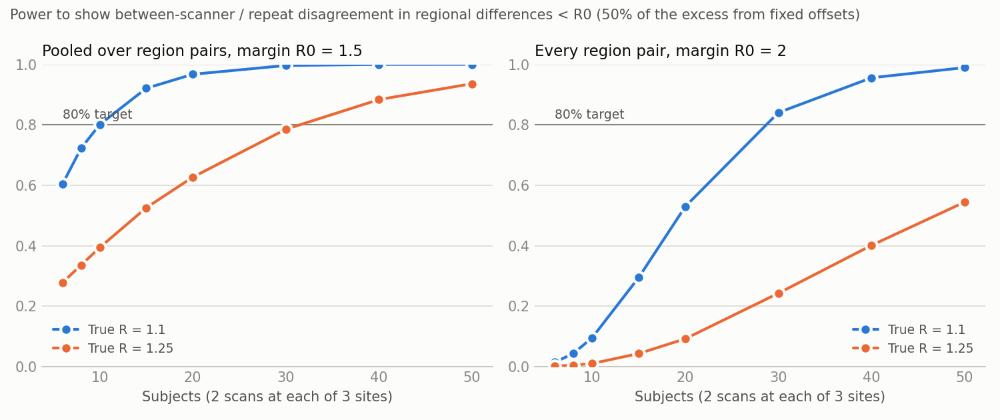

# k99-power-analyses

Two power analyses for multi-site MRI studies:

1. [**Scanner agreement in regional differences**](#analysis-1-scanner-agreement-in-regional-differences)
   ([`agreement.py`](agreement.py)): every subject is scanned twice at each of 3
   sites. Can we show that scanners preserve each subject's between-region
   differences about as well as repeat scans on one scanner do?
2. [**Detectable group-by-region effect**](#analysis-2-detectable-group-by-region-effect)
   ([`group_effect.py`](group_effect.py)): each subject is scanned at one of 14
   sites, once a year for 3 years. How large a group difference in a region can we
   detect?

## Quick start

1. Install the dependencies (numpy, scipy, and matplotlib for plots). Any Python 3,
   including the one built into macOS, works:

   ```bash
   python3 -m pip install -r requirements.txt
   ```

2. Open the script for the analysis you want and edit the **Parameters** block at
   the top (see below).

3. Run it:

   ```bash
   python3 agreement.py
   ```

   ```bash
   python3 group_effect.py
   ```

   Each run takes a few seconds (`agreement.py` about 15 seconds; the first run
   can take longer while matplotlib sets itself up) and writes a table (`.csv`)
   and a plot (`.png`) to the current folder. On Windows, type `python` instead of `python3`.

(With Nix, `nix-shell --run "python3 agreement.py"` does steps 1 and 3 together,
and likewise for `group_effect.py`.)

All parameter values in both scripts are **placeholders**. Replace them with your
design and with estimates from prior data.

The plots shown below are copies in `docs/`, made with the default parameters. They
don't update when you change the parameters; to refresh them, copy the new `.png`
files into `docs/`. The [`checks/`](checks) folder has scripts that verify the
derivations numerically; they also need pandas and statsmodels
(`python3 -m pip install pandas statsmodels`), and `check_group_effect_lmer.R` needs
R with lme4 and lmerTest.

---

## Analysis 1: scanner agreement in regional differences

N subjects are each scanned twice at each of 3 sites, and mean magnetic
susceptibility (ppb, from QSM) is measured in 5 deep grey matter regions. The
outcome is every **pairwise difference between regions within a scan** (10
differences), so anything that shifts a whole scan cancels. The question is
whether scanners preserve each subject's regional differences about as well as a
repeat scan on the same scanner does.

The target is the ratio

> **R** = (mean squared difference between single scans at two sites) / (mean
> squared difference between two repeat scans at one site),

for the same subject and regional difference. Both **fixed scanner offsets** (a
scanner shifting one region relative to another in everyone) and
**subject-specific scanner scatter** count as disagreement. R is at least 1, since
a between-scanner difference always includes the repeat noise, so "the same size
or smaller" is shown as **R below a margin R₀**:

- **Primary test:** pooled over all region pairs, R < 1.5 (one-sided). R₀ = 1.5
  means between-scanner differences have at most 1.22 times the SD of repeat
  differences.
- **Secondary test:** every one of the 10 region pairs has R < 2 (all 10 must pass;
  no correction is needed for that).

Both are F tests of the between-site mean square within subjects against the
repeat mean square (see [How it works](#how-it-works)). For each planning scenario
and number of subjects, [`agreement.py`](agreement.py) estimates the **power** of
both tests and the **smallest margin** each can show at the target power.

### Parameters

| Parameter | Default | What it is |
|---|---|---|
| `N_grid` | 6, 8, 10, …, 50 | Numbers of subjects to evaluate (the x-axis of the power curves). At least 2. |
| `n_rep` | 2 | Scans per subject at each site (at least 2: the repeats measure within-scanner noise). |
| `target_power` | 0.80 | Required power. |
| `alpha` | 0.05 | One-sided level of each test. |
| `R0_pooled`, `R0_pair` | 1.5, 2.0 | Margins for the pooled and every-pair tests. |
| `sd_noise` | 2.1 | SD (ppb) of region-level scan-to-scan noise. Power depends only on ratios; this only converts the scenarios to ppb. |
| `scenarios` | R = 1.1, R = 1.25 | Planning scenarios: the true pooled R (at most two, for the plot). |
| `offset_share` | 0.5 | Fraction of R − 1 due to fixed scanner offsets; the rest is subject-specific scatter (`sd_site`). |
| `offset_pattern` | site 3, region 1 | Where the fixed offsets are (sites × regions), scaled to fit `offset_share`. The default, one region shifted at one site, is the worst case for the every-pair test. |
| `n_sims` | 20000 | Simulated studies per scenario and sample size. |
| `seed` | 1 | Random seed, so results are reproducible. |

**Planning values.** The scanners will be harmonized in acquisition and
processing, so we plan for **R = 1.1–1.25**. In ppb, with repeat noise of 2.1 ppb
per region (Naji et al., 2022), R = 1.25 corresponds, for example, to fixed offsets
that change the scanners' regional differences by 1.5 ppb (root mean square), plus
subject-specific scatter of 0.74 ppb per region. Lin et al. (2015), with three
phantom-calibrated 3T scanners, found that cross-site errors in deep grey matter
were not significantly larger than within-site errors, which is consistent with R
near 1. Without harmonization, R can be much larger: Naji et al.'s cross-site
variability (from site-specific protocols) allows R up to about 2.9, and their
site biases of up to 4.1 ppb would by themselves exceed either margin.

> Naji N, Lauzon ML, Seres P, Stolz E, Frayne R, Lebel C, Beaulieu C, Wilman AH.
> Multisite reproducibility of quantitative susceptibility mapping and effective
> transverse relaxation rate in deep gray matter at 3 T using locally optimized
> sequences in 24 traveling heads. *NMR in Biomedicine*. 2022;35(11):e4788.
> https://doi.org/10.1002/nbm.4788
>
> Lin P-Y, Chao T-C, Wu M-L. Quantitative susceptibility mapping of human brain at
> 3T: a multisite reproducibility study. *American Journal of Neuroradiology*.
> 2015;36(3):467–474. https://doi.org/10.3174/ajnr.A4137

### Output

For each scenario and number of subjects, the script prints the **power** of the
pooled test at R₀ = 1.5 and of the every-pair test at R₀ = 2, and the **smallest
margin** each test can show with 80% power. It saves the table to
`agreement_curve.csv` and plots both power curves in `agreement_curve.png`. With the
defaults (half of R − 1 from fixed offsets):



| Subjects | Pooled power, R = 1.1 | Pooled power, R = 1.25 | Every-pair power, R = 1.1 | Every-pair power, R = 1.25 |
|---|---|---|---|---|
| 6 | 0.60 | 0.28 | 0.01 | 0.00 |
| 10 | 0.80 | 0.39 | 0.10 | 0.01 |
| 15 | 0.92 | 0.53 | 0.30 | 0.04 |
| 20 | 0.97 | 0.63 | 0.53 | 0.09 |
| 30 | > 0.99 | 0.79 | 0.84 | 0.24 |
| 50 | > 0.99 | 0.94 | 0.99 | 0.54 |

- **Pooled test:** 80% power with **about 10 subjects if R = 1.1, and about 30 if
  R = 1.25**. With 30 subjects, the smallest margin shown with 80% power is 1.31
  (R = 1.1) or 1.51 (R = 1.25).
- **Every-pair test:** much more demanding, because the worst of 10 pairs decides
  it, and a fixed offset in one region makes 4 pairs worse than the average. It
  needs about 30 subjects if R = 1.1; if R = 1.25, more than 50.
- Pooled power depends only on R, not on how R − 1 splits between offsets and
  scatter; the every-pair test is hurt most when the offsets are concentrated.

### How it works

For each regional difference, a two-way layout (subject × site, with repeats)
gives two mean squares: the variation between sites within subjects (site means
**not** removed, so fixed offsets count), with N × 2 degrees of freedom, and the
variation between repeats, with N × 3 degrees of freedom. Their ratio is
1 + 2(R − 1) times an F variable, so the test of R < R₀ is an exact F test when
there are no fixed offsets, and conservative when there are. The pooled test adds
the mean squares over 4 orthonormal contrasts that span all 10 pairwise
differences; it is the same as testing all 10 together. Subjects' own regional
patterns, their ages, and whole-scan offsets all cancel, so no between-subject
variance or age range is needed.

Things to settle in the analysis plan:

- **Make the repeats true repeats.** Reposition the subject between the two scans
  at a site. Otherwise the repeat noise is too small and the scanners look worse.
- **Check for outliers** (e.g. motion) before testing: variance ratios are
  sensitive to them.
- **Report what drives a failure:** the fixed offsets (site means of each regional
  difference) and the subject-specific scatter separately, with the 10 per-pair
  ratios and CIs.

Full derivation and assumptions:
[docs/agreement-derivation.md](docs/agreement-derivation.md).

---

## Analysis 2: detectable group-by-region effect

Subjects are recruited at 14 sites (22 per site, 308 in total), and each subject is
scanned **at one site, once a year for 3 years**. The outcome is measured in several
regions, and subjects belong to one of several groups (e.g. patients and controls).
The analysis model is

```
y ~ 0 + region + region:age_c + site + region:group +
    (1 | subject) + (1 | subject:visit) + (1 | subject:region)
```

where `age_c` is the subject's centered age at that visit. The group-by-region
effect is the difference between a group and the reference group in one region,
assumed the same at every visit. The two extra random effects describe how the
visits of one subject are related (see `retest_corr` below). Leaving them out and
fitting only `(1 | subject)` would treat the 3 visits of one region as independent
measurements and make the test too liberal. Each region's effect is tested
separately, Bonferroni-corrected across regions (and across groups, if there are
more than 2). The calculation
assumes the test is run as in lmerTest (R), with Satterthwaite degrees of freedom;
software that reports z-based p-values is too liberal with small samples.
For each number of subjects per site, [`group_effect.py`](group_effect.py) reports
the **power** to detect a given group difference and the **smallest group difference
detectable** at the target power.

> **Balanced-sites simplification.** For the power calculation, every site is
> assumed to recruit the same number of subjects from each group. This is a
> planning simplification, not a requirement of the analysis. It gives the best
> case for a given total N. Groups that are unbalanced within sites need a somewhat
> larger effect to reach the same power: in one example (20 sites of 3, split
> alternately 2:1 and 1:2), about 1–6% larger than a balanced design of the same
> size, depending on `region_corr`. More severe imbalance costs more. Use values of
> `subjects_per_site` divisible by `n_groups`; otherwise the script marks those rows
> and warns that the simplification holds only approximately.

### Parameters

| Parameter | Default | What it is |
|---|---|---|
| `n_sites` | 14 | Number of sites. |
| `planned_per_site` | 22 | Planned subjects per site (308 in total), marked on the plots. `None` for no mark. |
| `subjects_per_site` | 6, 10, …, 30 | List of subjects-per-site values to evaluate (the x-axis of the power curve). Each site is split as equally as possible across groups (see the balanced-sites note). |
| `n_groups` | 2 | Number of groups. Group 0 is the reference; each other group is compared with it. |
| `n_regions` | 10 | Number of regions (and of Bonferroni-corrected tests, with 2 groups). |
| `visit_years` | 0, 1, 2 | When each subject is scanned, in years from their first scan. All of a subject's scans are at the same site. Use `[0]` for one scan per subject. |
| `sd_scenarios` | Low SD: 10, High SD: 30 | SD (ppb) of one region's value in one scan across subjects with the same group, site, and age, as named scenarios; the plots and table show one curve per scenario. Defaults are the low and high values from three QSM studies (see [below](#where-the-low-and-high-sds-come-from)). It only converts the answer between d and ppb. |
| `region_corr` | 0.5 | Correlation between two regions in the same scan. Has little effect under the balanced-sites simplification. |
| `retest_corr` | 0.8 | Correlation between one region's values at two visits of the same subject, after adjusting for age. 1 − `retest_corr` is the share of the variance that changes from visit to visit (measurement noise and real fluctuation); only that share is averaged down by repeated visits. **Matters most** of the noise parameters. Not used with one visit. |
| `visit_region_corr` | 0.5 | Correlation between two regions' visit-to-visit changes (e.g. a whole-scan offset). Has very little effect. Not used with one visit. |
| `age_min`, `age_max` | 25, 65 | Age range at the first visit. Ages are drawn uniformly from this range, independently of group. |
| `alpha` | 0.05 | Family-wise two-sided level, split across the tests by Bonferroni. |
| `bonferroni` | `True` | Set to `False` for a single pre-specified test (one region, one group) at `alpha`. |
| `target_power` | 0.80 | Required power of one region's test. The chance of detecting at least one of several true regional effects is higher. |
| `effect_ppb` | 10 | Group difference (ppb) at which the power curve is computed. A placeholder. To get it from a previous study, see [below](#converting-a-previous-effect-estimate-to-d). |
| `n_designs` | 1000 | Random age draws averaged over. |
| `seed` | 1 | Random seed, so results are reproducible. |

To estimate the noise parameters from prior longitudinal data, fit the same model
and take its four variance estimates: τ² for `subject`, ω² for `subject:visit`, ψ²
for `subject:region`, and σ² for the residual. With V = τ² + ω² + ψ² + σ²,

- the SD (a value for `sd_scenarios`) = √V;
- `region_corr` = (τ² + ω²) / V;
- `retest_corr` = (τ² + ψ²) / V;
- `visit_region_corr` = ω² / (ω² + σ²).

With only one scan per subject, fit `(1 | subject)` alone and take the SD =
√(τ² + σ²) and `region_corr` = τ² / (τ² + σ²); `retest_corr` then needs
test-retest data from the same pipeline, ideally a year apart.

### Converting a previous effect estimate to d

The script's Cohen's d is **the group difference in one region divided by the
SD**: the between-subject SD of that region in one scan, *within a group,
after adjusting for age and site*. This is the d a cross-sectional study would
report; the repeated visits make it easier to detect, but don't change it. To use
an effect from a pilot study or the literature, convert it to this d (then compare
it with the detectable d, or multiply it by the SD to set `effect_ppb`), using
whichever of these the source reports:

| The source reports | d = | Notes |
|---|---|---|
| Group means and an SD | (mean₁ − mean₀) / SD | Use the pooled within-group SD. If that SD is not adjusted for age, d comes out **smaller** than the script's d. If the groups differ in age, the unadjusted means can also be off in either direction. |
| A group difference from a regression or mixed model with covariates | difference / residual SD | For a mixed model like the one above, the SD is √(τ² + σ²), the square root of the subject variance plus the residual variance. This matches the script's definition. |
| A two-sample t statistic, or the t for the group term in a regression | t × √(1/n₀ + 1/n₁) | n₀ and n₁ are the group sizes in that study. Exact for a two-sample t, and for a regression when the groups have the same covariate means. If they don't (e.g. groups differ in age), this underestimates d. |
| A difference with a 95% CI (lower, upper) | t = difference / SE, with SE = (upper − lower) / 3.92; then use the row above | 3.92 = 2 × 1.96 assumes a large-sample CI. For a t-based CI from a small study, use 2 × t₀.₉₇₅ with that study's df; 3.92 overstates the SE, so d comes out smaller. |
| Partial η² for the group effect (2 groups) | t = √(df × η² / (1 − η²)); then use the t row | df is the error df. For large, equal groups, d ≈ 2√(η² / (1 − η²)). |
| A point-biserial correlation r between group and outcome | t = r √(df / (1 − r²)); then use the t row | df = n₀ + n₁ − 2 (minus the number of covariates for a partial r). A plain r is not adjusted for age, so, as for group means, d comes out smaller. For large, equal groups, d ≈ 2r / √(1 − r²). |
| Hedges' g | ≈ d | g is d with a small-sample correction. |
| An effect in ppb, with the SD known for your study | effect / SD | |

Cautions:

- **Use a between-subject d.** A d from a paired or within-subject design (d_z,
  standardized by the SD of differences) is not comparable.
- **Use the same region and outcome definition.** A d from whole-brain or a
  different parcellation can differ a lot from one region's d.
- **Published effects are usually inflated** by publication bias and the winner's
  curse, especially from small studies. Consider planning for a smaller effect,
  e.g. the lower end of its confidence interval.
- **Different SDs give different d's.** d is unit-free, so it transfers across
  scanners better than raw units. But a d computed with a larger SD (unadjusted
  for age, or pooling across sites without site adjustment) understates the
  script's d, and one computed with a smaller SD overstates it.

### Output

For each value of `subjects_per_site`, the script prints the total N, the degrees
of freedom, the **smallest detectable group difference** as Cohen's d, and, for
each SD scenario, that difference in ppb and the **power to detect `effect_ppb`**.
It saves the table to `group_effect_curve.csv` and plots both curves, one line per
SD scenario, in `group_effect_curve.png`:

- left: power to detect `effect_ppb` against subjects per site, with the target
  power marked;
- right: smallest detectable difference (ppb) at the target power against subjects
  per site.

With the defaults (14 sites, 2 groups, 10 regions, 3 visits a year apart, so each
test is at α = 0.005; `retest_corr` and `effect_ppb` are placeholders):


| Subjects per site | N | Smallest detectable d | Low SD (10 ppb): detectable | Power at 10 ppb | High SD (30 ppb): detectable | Power at 10 ppb |
|---|---|---|---|---|---|---|
| 6 | 84 | 0.75 | 7.5 ppb | 0.98 | 22.6 ppb | 0.12 |
| 10 | 140 | 0.58 | 5.8 ppb | > 0.99 | 17.4 ppb | 0.24 |
| 14 | 196 | 0.49 | 4.9 ppb | > 0.99 | 14.6 ppb | 0.38 |
| 18 | 252 | 0.43 | 4.3 ppb | > 0.99 | 12.9 ppb | 0.51 |
| **22** | **308** | **0.39** | **3.9 ppb** | **> 0.99** | **11.7 ppb** | **0.63** |
| 30 | 420 | 0.33 | 3.3 ppb | > 0.99 | 10.0 ppb | 0.80 |

At the planned 308 subjects, the smallest detectable group difference is **3.9 ppb
if the SD is 10 ppb and 11.7 ppb if it is 30 ppb** (d = 0.39 either way). A middle
SD of 20 ppb would give 7.8 ppb. With one scan per subject, d would be 0.42, so the
second and third visits make the detectable difference about 7% smaller. That gain
depends almost entirely on `retest_corr`:

| `retest_corr` | 0.5 | 0.6 | 0.7 | 0.8 | 0.9 | 0.95 | (1 visit) |
|---|---|---|---|---|---|---|---|
| Smallest detectable d, 308 subjects × 3 visits | 0.34 | 0.36 | 0.37 | 0.39 | 0.40 | 0.41 | 0.42 |

With more than 2 groups, each row reports the least powerful comparison with the
reference group.

### Where the low and high SDs come from

The detectable difference in ppb is d × SD, where the SD is that of one region's
mean susceptibility in one scan, across people of the same age, group, and site.
Three studies of deep grey matter give quite different values:

| Source | How the SD was obtained | Low | High |
|---|---|---|---|
| Li et al. (2023): 220 people aged 10–70, one 3T scanner, MEDI with a CSF reference, regions drawn by hand | Residual SD after the linear age fit (supplementary Table S1): slope × age SD × √((1 − R²) / R²), with age SD 15.3 years | 17 ppb (caudate) | 34 ppb (substantia nigra, red nucleus); globus pallidus 30 |
| Lancione et al. (2022): 9 sites, 3–7 people each, mean ages 25–32, harmonized protocol, whole-brain reference | SD between people within a site, averaged over sites (Table 5) | 9 ppb (caudate) | 16–19 ppb (globus pallidus); putamen 11–12 |
| Naji et al. (2022): 24 people aged 20–49 scanned at 3 sites, iLSQR with whole-brain reference | SD between people from the mean ICC (0.97) and mean within-subject SD (2.36 ppb) over 7 regions: 2.36 × √(0.97 / 0.03) = 13.4 ppb | ≈ 10 ppb (after removing a 1 ppb/year age slope, assuming an age SD of about 8 years) | ≈ 14 ppb (no age adjustment, plus scan noise) |

We model **low = 10 ppb** (Lancione's caudate and putamen; Naji, age-adjusted) and
**high = 30 ppb** (Li's globus pallidus, close to Li's substantia nigra and red
nucleus).

Caveats:

- **The SD depends on the region.** In every study, the caudate and putamen have
  about half the SD of the globus pallidus, substantia nigra, and red nucleus. The
  script assumes one SD for all regions, so in ppb, the low scenario applies best to
  the caudate and putamen and the high scenario to the other nuclei.
- **The SD depends on the pipeline.** Li's SDs are about twice Lancione's in every
  region both measured. Li's CSF reference and its straight-line fit over ages 10–70
  both add spread, so the high scenario may be pessimistic for a pipeline with a
  whole-brain reference. Use the SD from the pipeline the study will use.
- **Each estimate is rough.** Lancione's SDs come from only 3–7 people per site.
  Naji's value is worked back from averages over regions, and with an ICC this close
  to 1 it is sensitive: an ICC of 0.96–0.98 gives 12–17 ppb.

> Lancione M, Bosco P, Costagli M, et al. Multi-centre and multi-vendor
> reproducibility of a standardized protocol for quantitative susceptibility mapping
> of the human brain at 3T. *Physica Medica*. 2022;103:37–45.
> https://doi.org/10.1016/j.ejmp.2022.09.012
>
> Naji N, Lauzon ML, Seres P, Stolz E, Frayne R, Lebel C, Beaulieu C, Wilman AH.
> Multisite reproducibility of quantitative susceptibility mapping and effective
> transverse relaxation rate in deep gray matter at 3 T using locally optimized
> sequences in 24 traveling heads. *NMR in Biomedicine*. 2022;35(11):e4788.
> https://doi.org/10.1002/nbm.4788
>
> Li G, Tong R, Zhang M, Gillen KM, Jiang W, Du Y, Wang Y, Li J. Age-dependent
> changes in brain iron deposition and volume in deep gray matter nuclei using
> quantitative susceptibility mapping. *NeuroImage*. 2023;269:119923.
> https://doi.org/10.1016/j.neuroimage.2023.119923

### How it works

The script uses an exact formula for the standard error of each group-by-region
effect under the mixed model, instead of simulating data, so it runs in seconds.

Under the balanced-sites simplification, the answer is essentially that of a
two-sample t test on one region, applied to each subject's average over visits.
With two equal groups and T visits,

SE ≈ 2·SD·√(r + (1 − r)/T) / √N,

where r is `retest_corr`. Repeated visits average down only the part of the
variance that changes from visit to visit, 1 − r. Stable differences between
subjects, which are usually most of the variance, stay; more visits can never make
the SE smaller than 2·SD·√r/√N. For a fixed total N, the number of sites, the
number of regions (apart from the Bonferroni correction), `region_corr`, and
`visit_region_corr` barely matter. Group differs only between subjects, so the
random subject effect cannot remove subject-to-subject noise from a group
comparison.

Bonferroni is slightly conservative here, because the regions are correlated. A
max-T correction would detect effects 0.5–8% smaller, depending on `region_corr`;
see the [derivation](docs/group-effect-derivation.md#what-the-power-refers-to).

Full derivation, simulation check, and assumptions:
[docs/group-effect-derivation.md](docs/group-effect-derivation.md).
