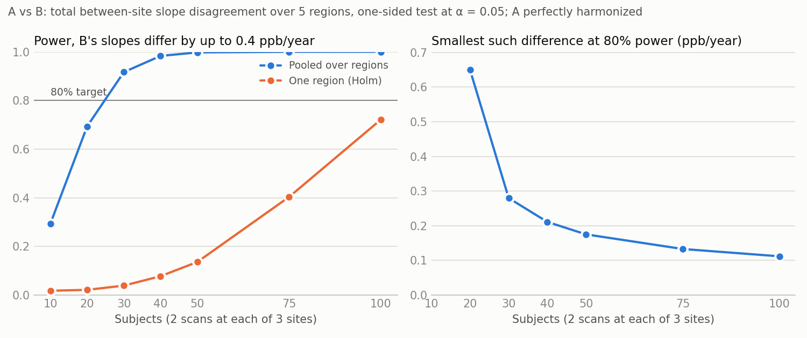

# k99-power-analyses

Two power analyses for multi-site MRI studies:

1. [**Comparing harmonizations**](#analysis-1-comparing-harmonizations-by-between-site-age-slope-disagreement)
   ([`harmonization.py`](harmonization.py)): every subject is scanned twice at each
   of 3 sites. Can we show that harmonization A leaves less between-site
   disagreement in regional age slopes than harmonization B?
2. [**Detectable group-by-region effect**](#analysis-2-detectable-group-by-region-effect)
   ([`group_effect.py`](group_effect.py)): each subject is scanned at one of 14
   sites, once a year for 3 years. How large a group difference in a region can we
   detect?

## Quick start

1. Install the dependencies (numpy, scipy, and matplotlib for plots). Any Python 3,
   including the one built into macOS, works:

   ```bash
   python3 -m pip install -r requirements.txt
   ```

2. Open the script for the analysis you want and edit the **Parameters** block at
   the top (see below).

3. Run it:

   ```bash
   python3 harmonization.py
   ```

   ```bash
   python3 group_effect.py
   ```

   Each run takes a few seconds (`harmonization.py` about half a minute; the first
   run can take longer while matplotlib sets itself up) and writes a table (`.csv`) and a plot (`.png`) to the current
   folder. On Windows, type `python` instead of `python3`.

(With Nix, `nix-shell --run "python3 harmonization.py"` does steps 1 and 3 together,
and likewise for `group_effect.py`.)

All parameter values in both scripts are **placeholders**. Replace them with your
design and with estimates from prior data.

The plots shown below are copies in `docs/`, made with the default parameters. They
don't update when you change the parameters; to refresh them, copy the new `.png`
files into `docs/`. The [`checks/`](checks) folder has scripts that verify the
derivations numerically; they also need pandas and statsmodels
(`python3 -m pip install pandas statsmodels`), and `check_group_effect_lmer.R` needs
R with lme4 and lmerTest.

---

## Analysis 1: comparing harmonizations by between-site age-slope disagreement

N subjects are each scanned twice at each of 3 sites, and mean magnetic
susceptibility (ppb, from QSM) is measured in 5 deep grey matter regions. Two
harmonization approaches, A and B, are applied to the same scans. After each
approach, each site's data, on their own, would be analyzed with

```
y ~ 0 + region + region:age_c + (1 | subject)
```

The question is whether A leaves **less between-site disagreement in the regional
age slopes** than B. An approach's disagreement in a region is the sum, over the 3
pairs of sites, of the squared difference between the two sites' age slopes (3
times the variance of that region's slope across sites).

- **Primary test:** A's disagreement, summed over the 5 regions, is smaller than
  B's (one-sided).
- **Secondary tests:** the same comparison in each region, Holm-corrected across
  regions, to say where A helps.

For each number of subjects, [`harmonization.py`](harmonization.py) estimates the
**power** of the primary test in a planning scenario, each region's chance of
being declared by the secondary tests, and the **smallest disagreement in B**
that the primary test detects at the target power (see
[How it works](#how-it-works)).

### Parameters

| Parameter | Default | What it is |
|---|---|---|
| `N_grid` | 10, 20, …, 100 | Numbers of subjects to evaluate (the x-axis of the power curve). At least 3. |
| `target_power` | 0.80 | Required power of the primary test. |
| `alpha` | 0.05 | One-sided level of each test. |
| `age_slope` | 1.0 | True age slope in every region (ppb per year), from Li et al. (2023). Scanner gain mismatches turn into slope differences in proportion to it. |
| `sd_between` | 20 | SD (ppb) of true susceptibility across subjects of the same age, from Li et al. (2023). A gain mismatch lets this leak into between-site differences as extra noise. |
| `age_min`, `age_max` | 25, 65 | Age range of the sample. Ages are drawn uniformly from this range. |
| `n_rep` | 2 | Scans per subject at each site, averaged before analysis. |
| `sd_scan` | 1.0 | SD (ppb) of a whole-scan offset: how much all of a subject's regional values shift together from one scan to the next. |
| `sd_noise` | 2.1 | SD (ppb) of region-level scan-to-scan noise. |
| `sd_site` | 2.9 | SD (ppb) of a region-level subject-by-site deviation that repeats in every scan at that site, so repeat scans do not reduce it. |
| `noise_corr` | 0.9 | Correlation between A's and B's noise. Both come from the same scans, so it is high; 1 if both are per-site rescalings of the same values. |
| `gain_A`, `gain_B` | A: all 1; B: sites 1.0, 0.8, 1.2 | Planning scenario: the gain (scale) each approach leaves at each site, by region (rows) and site (columns). Equal gains across sites mean no slope disagreement; B's default gives slope differences of 0.2–0.4 ppb per year. |
| `n_sims` | 10000 | Simulated studies per sample size. |
| `seed` | 1 | Random seed, so results are reproducible. |

**Where the values come from.**

- **Age slope and between-subject SD.** Li et al. (2023) measured six deep grey
  matter nuclei in 220 healthy people aged 10–70 on one 3T scanner. Their linear
  fits of mean susceptibility on age (supplementary Table S1) gave 0.79 ppb per year
  in the head of the caudate, 1.08 in the putamen, 1.01 in the globus pallidus,
  1.17 in the red nucleus, 0.84 in the dentate nucleus, and 0.42 in the substantia
  nigra, with SEs of 0.08–0.15 (from the reported R² and n). We use **1.0 ppb per
  year (SE 0.1)**. The SD around their fits was 17–34 ppb; we use 20. These are
  cross-sectional estimates from one scanner and one QSM pipeline (MEDI with a CSF
  reference).
- **Noise.** Naji et al. (2022) scanned 24 traveling subjects twice at each of 3
  sites (two GE, one Siemens; site-specific protocols, iLSQR, referenced to the
  whole-brain mean, the same regions mapped to every scan). The mean within-site
  SD was 2.36 ppb, which we split 1:2 into `sd_scan` = 1.0 and `sd_noise` = 2.1
  (the split matters little). Their mean cross-site SD was 4.16 ppb, but it
  includes fixed site offsets, which cancel here. Their Bland–Altman SD of
  cross-site differences, which excludes the average bias, was at most 5.3 ppb, so
  one scan's cross-site SD is at most 5.3/√2 = 3.75 ppb, and
  `sd_site` ≤ √(3.75² − 2.36²) ≈ 2.9 ppb. Other 3T studies give cross-site SDs of
  4–12 ppb (e.g. Lancione et al., 2022: about 7 ppb).
- **Planning scenario.** Scanner gains differed by up to 4% between Naji's sites
  and by 18% between one pair of Lancione's. The default assumes B leaves gains of
  1.0, 0.8 and 1.2 at the three sites (a pessimistic, Lancione-like case) and A
  removes them completely.

> Li G, Tong R, Zhang M, Gillen KM, Jiang W, Du Y, Wang Y, Li J. Age-dependent
> changes in brain iron deposition and volume in deep gray matter nuclei using
> quantitative susceptibility mapping. *NeuroImage*. 2023;269:119923.
> https://doi.org/10.1016/j.neuroimage.2023.119923
>
> Naji N, Lauzon ML, Seres P, Stolz E, Frayne R, Lebel C, Beaulieu C, Wilman AH.
> Multisite reproducibility of quantitative susceptibility mapping and effective
> transverse relaxation rate in deep gray matter at 3 T using locally optimized
> sequences in 24 traveling heads. *NMR in Biomedicine*. 2022;35(11):e4788.
> https://doi.org/10.1002/nbm.4788
>
> Lancione M, Bosco P, Costagli M, et al. Multi-centre and multi-vendor
> reproducibility of a standardized protocol for quantitative susceptibility
> mapping of the human brain at 3T. *Physica Medica*. 2022;103:37–45.
> https://doi.org/10.1016/j.ejmp.2022.09.012

**Estimating the noise from your own traveling-subject data.** For each region,
the SD between a subject's two scans at the same site gives
√(`sd_scan`² + `sd_noise`²). The SD between sites of single scans, after removing
each site's mean offset and gain for that region, gives
√(`sd_scan`² + `sd_noise`² + `sd_site`²).

### Output

For each number of subjects, the script prints the **power of the primary test**,
each region's chance of being declared by the Holm-corrected secondary tests
(lowest and mean over regions), and the **smallest largest between-site slope
difference in B** that the primary test detects with 80% power, with A perfectly
harmonized and B's gain pattern scaled up or down. It saves the table to
`harmonization_curve.csv` and plots the curves in `harmonization_curve.png`. With
the defaults:



| Subjects | Power, pooled | Power, one region (Holm) | Smallest B slope difference at 80% power (ppb/year) |
|---|---|---|---|
| 10 | 0.29 | 0.02 | not reached |
| 20 | 0.69 | 0.02 | 0.65 |
| 30 | 0.92 | 0.04 | 0.28 |
| 50 | > 0.99 | 0.14 | 0.18 |
| 75 | > 0.99 | 0.40 | 0.13 |
| 100 | > 0.99 | 0.72 | 0.11 |

With B's slopes differing by up to 0.4 ppb per year (40% of the age slope),
**about 25 subjects** give 80% power to show that A disagrees less overall. Saying
which regions improve needs far more: each region's Holm-corrected test reaches 80%
power only at about 110 subjects. For a smaller mismatch in B, read the right
panel: at N = 50 the pooled test detects B's slopes differing by about 0.18 ppb per
year (B's gains 1.0, 0.91 and 1.09), and at N = 100 about 0.11.

The second scan per site helps little, because most of the noise between sites
(`sd_site`) repeats in every scan at that site.

### How it works

The per-site models are not used for testing; they define the slopes. For each
approach, region, and pair of sites, the difference between the two sites' slopes
is exactly the slope of a regression of each subject's between-site difference on
age. An approach's disagreement is a sum of squares of these slope differences.
The test estimates B's disagreement minus A's from the paired data, subtracts the
part that sampling noise adds to squared estimates (otherwise a noisier approach
would look worse even if it removed no scanner bias), and divides by a plug-in
standard error. The test is slightly conservative: at the null boundary, its
rejection rate is at most 0.044 for a nominal 0.05.

Things to settle in the analysis plan:

- **Estimate harmonization parameters out of sample.** If an approach fits its
  site parameters to the same traveling subjects, it fits their noise and looks
  better than it is. Fit them for each subject from the other subjects
  (cross-fitting), or from separate calibration data.
- **Check the overall scale.** An approach that shrinks all values shrinks the
  slope differences without improving agreement. If the pooled slopes differ
  between approaches, compare disagreement relative to each approach's slope.
- **Use one QSM pipeline and reference** for both approaches; Li et al. and Naji et
  al. differ in both.

Why not simpler tests? A model × site × age interaction tests whether the slope
differences *change*, not whether they *shrink*. Comparing the site × age test of
A with that of B compares p-values and ignores that both come from the same scans.

Full derivation and assumptions:
[docs/harmonization-derivation.md](docs/harmonization-derivation.md).

---

## Analysis 2: detectable group-by-region effect

Subjects are recruited at 14 sites (22 per site, 308 in total), and each subject is
scanned **at one site, once a year for 3 years**. The outcome is measured in several
regions, and subjects belong to one of several groups (e.g. patients and controls).
The analysis model is

```
y ~ 0 + region + region:age_c + site + region:group +
    (1 | subject) + (1 | subject:visit) + (1 | subject:region)
```

where `age_c` is the subject's centered age at that visit. The group-by-region
effect is the difference between a group and the reference group in one region,
assumed the same at every visit. The two extra random effects describe how the
visits of one subject are related (see `retest_corr` below). Leaving them out and
fitting only `(1 | subject)` would treat the 3 visits of one region as independent
measurements and make the test too liberal. Each region's effect is tested
separately, Bonferroni-corrected across regions (and across groups, if there are
more than 2). The calculation
assumes the test is run as in lmerTest (R), with Satterthwaite degrees of freedom;
software that reports z-based p-values is too liberal with small samples.
For each number of subjects per site, [`group_effect.py`](group_effect.py) reports
the **power** to detect a given group difference and the **smallest group difference
detectable** at the target power.

> **Balanced-sites simplification.** For the power calculation, every site is
> assumed to recruit the same number of subjects from each group. This is a
> planning simplification, not a requirement of the analysis. It gives the best
> case for a given total N. Groups that are unbalanced within sites need a somewhat
> larger effect to reach the same power: in one example (20 sites of 3, split
> alternately 2:1 and 1:2), about 1–6% larger than a balanced design of the same
> size, depending on `region_corr`. More severe imbalance costs more. Use values of
> `subjects_per_site` divisible by `n_groups`; otherwise the script marks those rows
> and warns that the simplification holds only approximately.

### Parameters

| Parameter | Default | What it is |
|---|---|---|
| `n_sites` | 14 | Number of sites. |
| `planned_per_site` | 22 | Planned subjects per site (308 in total), marked on the plots. `None` for no mark. |
| `subjects_per_site` | 6, 10, …, 30 | List of subjects-per-site values to evaluate (the x-axis of the power curve). Each site is split as equally as possible across groups (see the balanced-sites note). |
| `n_groups` | 2 | Number of groups. Group 0 is the reference; each other group is compared with it. |
| `n_regions` | 10 | Number of regions (and of Bonferroni-corrected tests, with 2 groups). |
| `visit_years` | 0, 1, 2 | When each subject is scanned, in years from their first scan. All of a subject's scans are at the same site. Use `[0]` for one scan per subject. |
| `sd_scenarios` | Low SD: 10, High SD: 30 | SD (ppb) of one region's value in one scan across subjects with the same group, site, and age, as named scenarios; the plots and table show one curve per scenario. Defaults are the low and high values from three QSM studies (see [below](#where-the-low-and-high-sds-come-from)). It only converts the answer between d and ppb. |
| `region_corr` | 0.5 | Correlation between two regions in the same scan. Has little effect under the balanced-sites simplification. |
| `retest_corr` | 0.8 | Correlation between one region's values at two visits of the same subject, after adjusting for age. 1 − `retest_corr` is the share of the variance that changes from visit to visit (measurement noise and real fluctuation); only that share is averaged down by repeated visits. **Matters most** of the noise parameters. Not used with one visit. |
| `visit_region_corr` | 0.5 | Correlation between two regions' visit-to-visit changes (e.g. a whole-scan offset). Has very little effect. Not used with one visit. |
| `age_min`, `age_max` | 25, 65 | Age range at the first visit. Ages are drawn uniformly from this range, independently of group. |
| `alpha` | 0.05 | Family-wise two-sided level, split across the tests by Bonferroni. |
| `bonferroni` | `True` | Set to `False` for a single pre-specified test (one region, one group) at `alpha`. |
| `target_power` | 0.80 | Required power of one region's test. The chance of detecting at least one of several true regional effects is higher. |
| `effect_ppb` | 10 | Group difference (ppb) at which the power curve is computed. A placeholder. To get it from a previous study, see [below](#converting-a-previous-effect-estimate-to-d). |
| `n_designs` | 1000 | Random age draws averaged over. |
| `seed` | 1 | Random seed, so results are reproducible. |

To estimate the noise parameters from prior longitudinal data, fit the same model
and take its four variance estimates: τ² for `subject`, ω² for `subject:visit`, ψ²
for `subject:region`, and σ² for the residual. With V = τ² + ω² + ψ² + σ²,

- the SD (a value for `sd_scenarios`) = √V;
- `region_corr` = (τ² + ω²) / V;
- `retest_corr` = (τ² + ψ²) / V;
- `visit_region_corr` = ω² / (ω² + σ²).

With only one scan per subject, fit `(1 | subject)` alone and take the SD =
√(τ² + σ²) and `region_corr` = τ² / (τ² + σ²); `retest_corr` then needs
test-retest data from the same pipeline, ideally a year apart.

### Converting a previous effect estimate to d

The script's Cohen's d is **the group difference in one region divided by the
SD**: the between-subject SD of that region in one scan, *within a group,
after adjusting for age and site*. This is the d a cross-sectional study would
report; the repeated visits make it easier to detect, but don't change it. To use
an effect from a pilot study or the literature, convert it to this d (then compare
it with the detectable d, or multiply it by the SD to set `effect_ppb`), using
whichever of these the source reports:

| The source reports | d = | Notes |
|---|---|---|
| Group means and an SD | (mean₁ − mean₀) / SD | Use the pooled within-group SD. If that SD is not adjusted for age, d comes out **smaller** than the script's d. If the groups differ in age, the unadjusted means can also be off in either direction. |
| A group difference from a regression or mixed model with covariates | difference / residual SD | For a mixed model like the one above, the SD is √(τ² + σ²), the square root of the subject variance plus the residual variance. This matches the script's definition. |
| A two-sample t statistic, or the t for the group term in a regression | t × √(1/n₀ + 1/n₁) | n₀ and n₁ are the group sizes in that study. Exact for a two-sample t, and for a regression when the groups have the same covariate means. If they don't (e.g. groups differ in age), this underestimates d. |
| A difference with a 95% CI (lower, upper) | t = difference / SE, with SE = (upper − lower) / 3.92; then use the row above | 3.92 = 2 × 1.96 assumes a large-sample CI. For a t-based CI from a small study, use 2 × t₀.₉₇₅ with that study's df; 3.92 overstates the SE, so d comes out smaller. |
| Partial η² for the group effect (2 groups) | t = √(df × η² / (1 − η²)); then use the t row | df is the error df. For large, equal groups, d ≈ 2√(η² / (1 − η²)). |
| A point-biserial correlation r between group and outcome | t = r √(df / (1 − r²)); then use the t row | df = n₀ + n₁ − 2 (minus the number of covariates for a partial r). A plain r is not adjusted for age, so, as for group means, d comes out smaller. For large, equal groups, d ≈ 2r / √(1 − r²). |
| Hedges' g | ≈ d | g is d with a small-sample correction. |
| An effect in ppb, with the SD known for your study | effect / SD | |

Cautions:

- **Use a between-subject d.** A d from a paired or within-subject design (d_z,
  standardized by the SD of differences) is not comparable.
- **Use the same region and outcome definition.** A d from whole-brain or a
  different parcellation can differ a lot from one region's d.
- **Published effects are usually inflated** by publication bias and the winner's
  curse, especially from small studies. Consider planning for a smaller effect,
  e.g. the lower end of its confidence interval.
- **Different SDs give different d's.** d is unit-free, so it transfers across
  scanners better than raw units. But a d computed with a larger SD (unadjusted
  for age, or pooling across sites without site adjustment) understates the
  script's d, and one computed with a smaller SD overstates it.

### Output

For each value of `subjects_per_site`, the script prints the total N, the degrees
of freedom, the **smallest detectable group difference** as Cohen's d, and, for
each SD scenario, that difference in ppb and the **power to detect `effect_ppb`**.
It saves the table to `group_effect_curve.csv` and plots both curves, one line per
SD scenario, in `group_effect_curve.png`:

- left: power to detect `effect_ppb` against subjects per site, with the target
  power marked;
- right: smallest detectable difference (ppb) at the target power against subjects
  per site.

With the defaults (14 sites, 2 groups, 10 regions, 3 visits a year apart, so each
test is at α = 0.005; `retest_corr` and `effect_ppb` are placeholders):


| Subjects per site | N | Smallest detectable d | Low SD (10 ppb): detectable | Power at 10 ppb | High SD (30 ppb): detectable | Power at 10 ppb |
|---|---|---|---|---|---|---|
| 6 | 84 | 0.75 | 7.5 ppb | 0.98 | 22.6 ppb | 0.12 |
| 10 | 140 | 0.58 | 5.8 ppb | > 0.99 | 17.4 ppb | 0.24 |
| 14 | 196 | 0.49 | 4.9 ppb | > 0.99 | 14.6 ppb | 0.38 |
| 18 | 252 | 0.43 | 4.3 ppb | > 0.99 | 12.9 ppb | 0.51 |
| **22** | **308** | **0.39** | **3.9 ppb** | **> 0.99** | **11.7 ppb** | **0.63** |
| 30 | 420 | 0.33 | 3.3 ppb | > 0.99 | 10.0 ppb | 0.80 |

At the planned 308 subjects, the smallest detectable group difference is **3.9 ppb
if the SD is 10 ppb and 11.7 ppb if it is 30 ppb** (d = 0.39 either way). A middle
SD of 20 ppb would give 7.8 ppb. With one scan per subject, d would be 0.42, so the
second and third visits make the detectable difference about 7% smaller. That gain
depends almost entirely on `retest_corr`:

| `retest_corr` | 0.5 | 0.6 | 0.7 | 0.8 | 0.9 | 0.95 | (1 visit) |
|---|---|---|---|---|---|---|---|
| Smallest detectable d, 308 subjects × 3 visits | 0.34 | 0.36 | 0.37 | 0.39 | 0.40 | 0.41 | 0.42 |

With more than 2 groups, each row reports the least powerful comparison with the
reference group.

### Where the low and high SDs come from

The detectable difference in ppb is d × SD, where the SD is that of one region's
mean susceptibility in one scan, across people of the same age, group, and site.
Three studies of deep grey matter give quite different values:

| Source | How the SD was obtained | Low | High |
|---|---|---|---|
| Li et al. (2023): 220 people aged 10–70, one 3T scanner, MEDI with a CSF reference, regions drawn by hand | Residual SD after the linear age fit (supplementary Table S1): slope × age SD × √((1 − R²) / R²), with age SD 15.3 years | 17 ppb (caudate) | 34 ppb (substantia nigra, red nucleus); globus pallidus 30 |
| Lancione et al. (2022): 9 sites, 3–7 people each, mean ages 25–32, harmonized protocol, whole-brain reference | SD between people within a site, averaged over sites (Table 5) | 9 ppb (caudate) | 16–19 ppb (globus pallidus); putamen 11–12 |
| Naji et al. (2022): 24 people aged 20–49 scanned at 3 sites, iLSQR with whole-brain reference | SD between people from the mean ICC (0.97) and mean within-subject SD (2.36 ppb) over 7 regions: 2.36 × √(0.97 / 0.03) = 13.4 ppb | ≈ 10 ppb (after removing a 1 ppb/year age slope, assuming an age SD of about 8 years) | ≈ 14 ppb (no age adjustment, plus scan noise) |

We model **low = 10 ppb** (Lancione's caudate and putamen; Naji, age-adjusted) and
**high = 30 ppb** (Li's globus pallidus, close to Li's substantia nigra and red
nucleus).

Caveats:

- **The SD depends on the region.** In every study, the caudate and putamen have
  about half the SD of the globus pallidus, substantia nigra, and red nucleus. The
  script assumes one SD for all regions, so in ppb, the low scenario applies best to
  the caudate and putamen and the high scenario to the other nuclei.
- **The SD depends on the pipeline.** Li's SDs are about twice Lancione's in every
  region both measured. Li's CSF reference and its straight-line fit over ages 10–70
  both add spread, so the high scenario may be pessimistic for a pipeline with a
  whole-brain reference. Use the SD from the pipeline the study will use.
- **Each estimate is rough.** Lancione's SDs come from only 3–7 people per site.
  Naji's value is worked back from averages over regions, and with an ICC this close
  to 1 it is sensitive: an ICC of 0.96–0.98 gives 12–17 ppb.

> Lancione M, Bosco P, Costagli M, et al. Multi-centre and multi-vendor
> reproducibility of a standardized protocol for quantitative susceptibility mapping
> of the human brain at 3T. *Physica Medica*. 2022;103:37–45.
> https://doi.org/10.1016/j.ejmp.2022.09.012
>
> Naji N, Lauzon ML, Seres P, Stolz E, Frayne R, Lebel C, Beaulieu C, Wilman AH.
> Multisite reproducibility of quantitative susceptibility mapping and effective
> transverse relaxation rate in deep gray matter at 3 T using locally optimized
> sequences in 24 traveling heads. *NMR in Biomedicine*. 2022;35(11):e4788.
> https://doi.org/10.1002/nbm.4788
>
> Li et al. (2023): see [Analysis 1](#analysis-1-comparing-harmonizations-by-between-site-age-slope-disagreement).

### How it works

The script uses an exact formula for the standard error of each group-by-region
effect under the mixed model, instead of simulating data, so it runs in seconds.

Under the balanced-sites simplification, the answer is essentially that of a
two-sample t test on one region, applied to each subject's average over visits.
With two equal groups and T visits,

SE ≈ 2·SD·√(r + (1 − r)/T) / √N,

where r is `retest_corr`. Repeated visits average down only the part of the
variance that changes from visit to visit, 1 − r. Stable differences between
subjects, which are usually most of the variance, stay; more visits can never make
the SE smaller than 2·SD·√r/√N. For a fixed total N, the number of sites, the
number of regions (apart from the Bonferroni correction), `region_corr`, and
`visit_region_corr` barely matter. Group differs only between subjects, so the
random subject effect cannot remove subject-to-subject noise from a group
comparison.

Bonferroni is slightly conservative here, because the regions are correlated. A
max-T correction would detect effects 0.5–8% smaller, depending on `region_corr`;
see the [derivation](docs/group-effect-derivation.md#what-the-power-refers-to).

Full derivation, simulation check, and assumptions:
[docs/group-effect-derivation.md](docs/group-effect-derivation.md).
