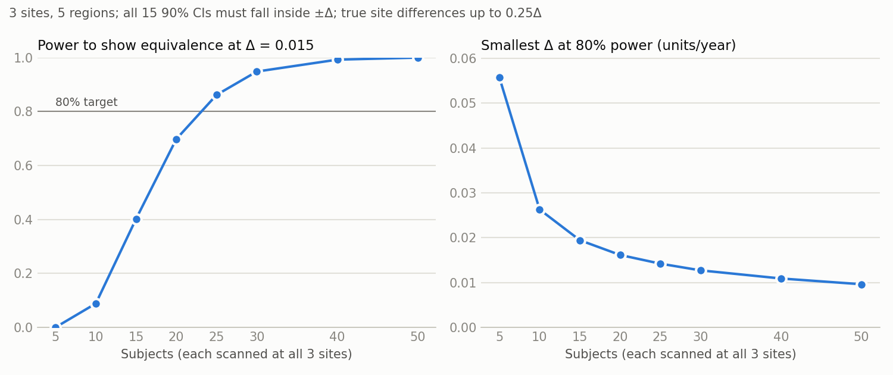
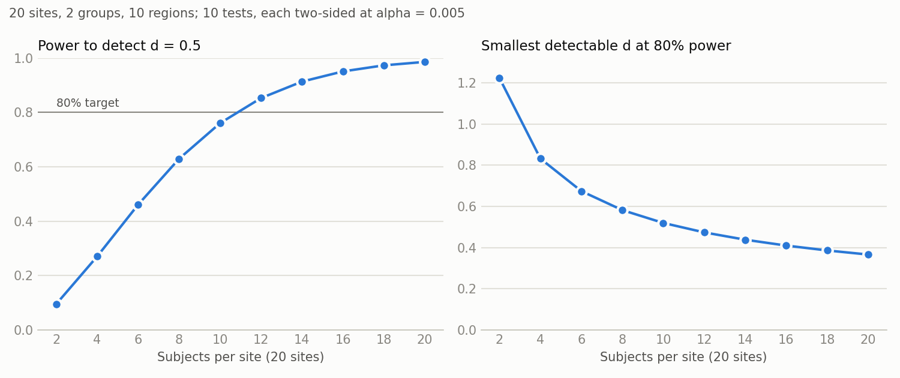

# k99-power-analyses

Two power analyses for multi-site MRI studies:

1. [**Cross-site equivalence of age effects**](#analysis-1-cross-site-equivalence-of-age-effects)
   ([`equivalence.py`](equivalence.py)): every subject is scanned at all 3 sites.
   How small a between-site difference in regional age effects can we rule out?
2. [**Detectable group-by-region effect**](#analysis-2-detectable-group-by-region-effect)
   ([`group_effect.py`](group_effect.py)): each subject is scanned at one of many
   sites. How large a group difference in a region can we detect?

## Quick start

1. Install the dependencies (numpy, scipy, and matplotlib for plots). Any Python 3,
   including the one built into macOS, works:

   ```bash
   python3 -m pip install -r requirements.txt
   ```

2. Open the script for the analysis you want and edit the **Parameters** block at
   the top (see below).

3. Run it:

   ```bash
   python3 equivalence.py
   ```

   ```bash
   python3 group_effect.py
   ```

   Each run takes a few seconds and writes a table (`.csv`) and a plot (`.png`) to
   the current folder. On Windows, type `python` instead of `python3`.

(With Nix, `nix-shell --run "python3 equivalence.py"` does steps 1 and 3 together,
and likewise for `group_effect.py`.)

All parameter values in both scripts are **placeholders**. Replace them with your
design and with estimates from prior data.

The plots shown below are copies in `docs/`, made with the default parameters. They
don't update when you change the parameters; to refresh them, copy the new `.png`
files into `docs/`. The [`checks/`](checks) folder has scripts that verify the
derivations numerically (they also need pandas and statsmodels).

---

## Analysis 1: cross-site equivalence of age effects

N subjects are each scanned at all 3 sites, and the outcome is measured in 5
regions. Each site's data, on their own, would be analyzed with

```
y ~ 0 + region + region:age_c + (1 | subject)
```

The question is whether the regional age slopes from this model are the same at
every site. For each number of subjects, [`equivalence.py`](equivalence.py)
estimates the **power** to show that they are the same within a chosen margin Δ,
and the **smallest Δ** that can be shown at the target power.

The test itself does not use the per-site mixed models. It is 15 ordinary
regressions, one per region and pair of sites, of each subject's between-site
difference on age (see [How it works](#how-it-works)).

### Parameters

| Parameter | Default | What it is |
|---|---|---|
| `N_grid` | 5, 10, …, 50 | Numbers of subjects to evaluate (the x-axis of the power curve). At least 3. |
| `target_power` | 0.80 | Required probability that the study shows equivalence. |
| `Delta` | 0.015 | Equivalence margin Δ (outcome units per year) at which the power curve is computed. |
| `sd_scan` | 0.05 | SD of a whole-scan offset: how much all of a subject's regional values shift together from one scan to another. |
| `sd_noise` | 0.10 | SD of the measurement noise in one region in one scan, beyond the whole-scan offset. The same for all sites and regions. |
| `age_min`, `age_max` | 25, 65 | Age range of the sample. Ages are drawn uniformly from this range. |
| `true_dev` | site 3: 0.25 | Planning scenario: each site's true age-slope deviation, as a fraction of Δ (5 regions × 3 sites). Only differences between sites matter. The default makes site 3 differ from the others by 0.25Δ in every region (see below). |
| `alpha` | 0.05 | Level of each one-sided test (gives 90% CIs). |
| `n_sims` | 10000 | Simulated studies per sample size. Gives Δ to about ±1%. |
| `seed` | 1 | Random seed, so results are reproducible. |

**Planning scenario.** Power must be computed for some assumed true difference
between sites. Assuming the sites are exactly equal is the best case and rarely
true; small true differences reduce power a lot. With the defaults at N = 20, power
at Δ = 0.015 is 0.90 if the sites are exactly equal, 0.70 with the default
0.25Δ difference, and 0.15 with a 0.5Δ difference.

**Estimating `sd_scan` and `sd_noise`.** Use traveling-subject data: the same
subjects scanned on the scanners in question. Test-retest data from a single
scanner understate the noise, because they miss differences in how each scanner
measures each subject. For each region and pair of sites, regress the subjects'
between-site differences on age and keep the residuals. Then:

- λ² = (average residual variance) / 2;
- `sd_scan`² = (average covariance between the residuals of two different regions,
  for the same pair of sites) / 2;
- `sd_noise`² = λ² − `sd_scan`².

You don't need between-subject variance, regional means, the true age slopes, or
fixed site offsets, because they cancel out.

### Output: Δ

For each number of subjects, the script prints the **power to show equivalence at
`Delta`** and the **smallest Δ** that can be shown at the target power. It saves
the table to `equivalence_curve.csv` and plots both curves in
`equivalence_curve.png`. With the defaults (all noise values are placeholders):



| Subjects | Power at Δ = 0.015 | Smallest Δ at 80% power |
|---|---|---|
| 5 | 0.00 | 0.056 |
| 10 | 0.09 | 0.026 |
| 15 | 0.40 | 0.019 |
| 20 | 0.70 | 0.016 |
| 30 | 0.95 | 0.013 |
| 50 | > 0.99 | 0.010 |

Δ is the **equivalence margin**: a between-site difference in age slope, in
outcome units per year, applied to every region. With the given number of subjects,
a study has `target_power` chance of showing that every between-site slope
difference lies within ±Δ. Smaller is better. Whether a given Δ is small enough is
a scientific judgment: compare it with the expected age slopes and with the
smallest site difference that would matter for your conclusions. Choose the margin
before you see the data.

With few subjects, much of the cost comes from estimating a separate standard error
for each of the 15 comparisons. If the noise really is equal across sites and
regions, an analysis that pools the variance (one mixed model across all sites)
can show a smaller Δ: about 0.041 instead of 0.056 at N = 5, with little difference
from N = 20. See the
[pooled-variance option](docs/equivalence-derivation.md#pooled-variance-option).

### How it works

A non-significant site × age interaction does not show that sites agree; an
equivalence test can. For each region (5) and each pair of sites (3), the analysis
regresses each subject's difference between the two sites on age. That slope is
exactly the difference between the two sites' age slopes from the per-site models.
Its 90% CI must fall inside (−Δ, +Δ), and the sites count as "the same" only if
**all 15** comparisons pass. The script simulates many studies and reports how often
that happens.

Full derivation and assumptions: [docs/equivalence-derivation.md](docs/equivalence-derivation.md).

---

## Analysis 2: detectable group-by-region effect

Subjects are recruited at many sites, and each subject is scanned **once, at one
site**. The outcome is measured in several regions, and subjects belong to one of
several groups (e.g. patients and controls). The analysis model is

```
y ~ 0 + region + region:age_c + site + region:group + (1 | subject)
```

The group-by-region effect is the difference between a group and the reference
group in one region. Each region's effect is tested separately, Bonferroni-corrected
across regions (and across groups, if there are more than 2). The calculation
assumes the test is run as in lmerTest (R), with Satterthwaite degrees of freedom;
software that reports z-based p-values is too liberal with small samples.
For each number of subjects per site, [`group_effect.py`](group_effect.py) reports
the **power** to detect a given group difference and the **smallest group difference
detectable** at the target power.

> **Balanced-sites simplification.** For the power calculation, every site is
> assumed to recruit the same number of subjects from each group. This is a
> planning simplification, not a requirement of the analysis. It gives the best
> case for a given total N. Groups that are unbalanced within sites need a somewhat
> larger effect to reach the same power, typically 2–7% larger. Use values of
> `subjects_per_site` divisible by `n_groups`; otherwise the script marks those rows
> and warns that the simplification holds only approximately.

### Parameters

| Parameter | Default | What it is |
|---|---|---|
| `n_sites` | 20 | Number of sites. |
| `subjects_per_site` | 2, 4, …, 20 | List of subjects-per-site values to evaluate (the x-axis of the power curve). Each is split equally across groups (balanced-sites simplification). |
| `n_groups` | 2 | Number of groups. Group 0 is the reference; each other group is compared with it. |
| `n_regions` | 10 | Number of regions (and of Bonferroni-corrected tests, with 2 groups). |
| `sd_total` | 1.0 | SD of one region's value across subjects with the same group, site, and age. Only scales the answer in outcome units; leave at 1 to get the answer in SD units. |
| `region_corr` | 0.5 | Correlation between two regions of the same subject. Has little effect under the balanced-sites simplification. |
| `age_min`, `age_max` | 25, 65 | Age range. Ages are drawn uniformly from this range, independently of group. |
| `alpha` | 0.05 | Family-wise two-sided level, split across the tests by Bonferroni. |
| `bonferroni` | `True` | Set to `False` for a single pre-specified test (one region, one group) at `alpha`. |
| `target_power` | 0.80 | Required power of one region's test. The chance of detecting at least one of several true regional effects is higher. |
| `effect_d` | 0.5 | Group difference, as Cohen's d, at which the power curve is computed. To get it from a previous study, see [below](#converting-a-previous-effect-estimate-to-d). |
| `n_designs` | 1000 | Random age draws averaged over. |
| `seed` | 1 | Random seed, so results are reproducible. |

To estimate `sd_total` and `region_corr` from prior data, fit the same model and
take `sd_total` = √(τ² + σ²) and `region_corr` = τ² / (τ² + σ²), where τ² is the
subject variance and σ² the residual variance.

### Converting a previous effect estimate to d

The script's Cohen's d is **the group difference in one region divided by
`sd_total`**: the between-subject SD of that region *within a group, after
adjusting for age and site*. To use an effect from a pilot study or the
literature, convert it to this d (then set `effect_d`, or compare it with the
detectable d), using whichever of these the source reports:

| The source reports | d = | Notes |
|---|---|---|
| Group means and an SD | (mean₁ − mean₀) / SD | Use the pooled within-group SD. If that SD is not adjusted for age, d comes out **smaller** than the script's d. If the groups differ in age, the unadjusted means can also be off in either direction. |
| A group difference from a regression or mixed model with covariates | difference / residual SD | For a mixed model like the one above, the SD is √(τ² + σ²), the square root of the subject variance plus the residual variance. This matches the script's definition. |
| A two-sample t statistic, or the t for the group term in a regression | t × √(1/n₀ + 1/n₁) | n₀ and n₁ are the group sizes in that study. Exact for a two-sample t, and for a regression when the groups don't differ on the covariates. If they do (e.g. groups differ in age), this underestimates d. |
| A difference with a 95% CI (lower, upper) | t = difference / SE, with SE = (upper − lower) / 3.92; then use the row above | 3.92 = 2 × 1.96 assumes a large-sample CI. For a t-based CI from a small study, use 2 × t₀.₉₇₅ with that study's df; 3.92 overstates the SE, so d comes out smaller. |
| Partial η² for the group effect (2 groups) | t = √(df × η² / (1 − η²)); then use the t row | df is the error df. For large, equal groups, d ≈ 2√(η² / (1 − η²)). |
| A point-biserial correlation r between group and outcome | t = r √(df / (1 − r²)); then use the t row | df = n₀ + n₁ − 2. For large, equal groups, d ≈ 2r / √(1 − r²). |
| Hedges' g | ≈ d | g is d with a small-sample correction. |
| An effect in outcome units, with `sd_total` known for your study | effect / `sd_total` | |

Cautions:

- **Use a between-subject d.** A d from a paired or within-subject design (d_z,
  standardized by the SD of differences) is not comparable.
- **Use the same region and outcome definition.** A d from whole-brain or a
  different parcellation can differ a lot from one region's d.
- **Published effects are usually inflated** by publication bias and the winner's
  curse, especially from small studies. Consider planning for a smaller effect,
  e.g. the lower end of its confidence interval.
- **Different SDs give different d's.** d is unit-free, so it transfers across
  scanners better than raw units. But a d computed with a larger SD (unadjusted
  for age, or pooling across sites without site adjustment) understates the
  script's d, and one computed with a smaller SD overstates it.

### Output

For each value of `subjects_per_site`, the script prints the total N, the degrees
of freedom, the **power at `effect_d`**, and the **smallest detectable group
difference** (as Cohen's d and in outcome units). It saves the table to
`group_effect_curve.csv` and plots both curves in `group_effect_curve.png`:

- left: power to detect `effect_d` against subjects per site, with the target power
  marked;
- right: smallest detectable d at the target power against subjects per site.

With the defaults (20 sites, 2 groups, 10 regions, so each test is at α = 0.005;
the noise and effect parameters are placeholders):



| Subjects per site | N | Power at d = 0.5 | Smallest detectable d |
|---|---|---|---|
| 4 | 80 | 0.27 | 0.83 |
| 8 | 160 | 0.63 | 0.58 |
| 10 | 200 | 0.76 | 0.52 |
| 12 | 240 | 0.85 | 0.47 |
| 16 | 320 | 0.95 | 0.41 |
| 20 | 400 | 0.99 | 0.37 |

With more than 2 groups, each row reports the least powerful comparison with the
reference group.

### How it works

The script uses an exact formula for the standard error of each group-by-region
effect under the mixed model, instead of simulating data, so it runs in seconds.

Under the balanced-sites simplification, the answer is essentially that of a
two-sample t test on one region (with two equal groups, SE ≈ 2·SD/√N). For a fixed
total N, the number of sites, the number of regions (apart from the Bonferroni
correction), and `region_corr` barely matter. Group differs only between subjects,
so the random subject effect cannot remove subject-to-subject noise from a group
comparison.

Bonferroni is slightly conservative here, because the regions are correlated. A
max-T correction would detect effects 0.5–8% smaller, depending on `region_corr`;
see the [derivation](docs/group-effect-derivation.md#what-the-power-refers-to).

Full derivation, simulation check, and assumptions:
[docs/group-effect-derivation.md](docs/group-effect-derivation.md).
